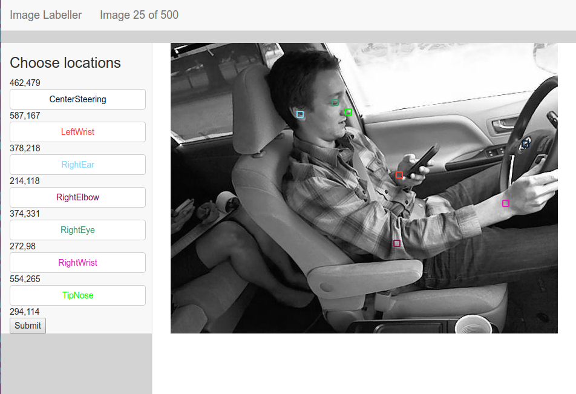

# distracteddriving
Analyze the data from State Farm's distracted driving competition on Kaggle

The problem here is to attempt to detect the activities of a driver in a car given just an image of the driver.  We have 20,000 labelled images and must nomalize for the possibility of any person being in the driver set.

This solution breaks the problem up into two main parts.
* construct a 3-D wireframe model of the driver
* use the wireframe data points as the training input to the final classifier

Step 1:  The wireframe model
Since we are working with image data, we start by training a series of nueral networks to detect some key points on the vehicle and the driver.  Since we don't start with such a network we'll need to create some training data from it. 
The Image Labeller is a python flask web page which can load individual frames of a subset from the training data and allows the user to manually pick the important locations from the image. 

 
