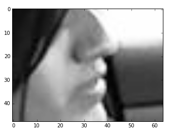

# distracteddriving
Analyze the data from State Farm's distracted driving competition on Kaggle

The problem here is to attempt to detect the activities of a driver in a car given just an image of the driver.  We have 20,000 labelled images and must nomalize for the possibility of any person being in the driver set.

This solution breaks the problem up into two main parts.
* construct a 3-D wireframe model of the driver
* use the wireframe data points as the training input to the final classifier

##Step 1:  The wireframe model
Since we are working with image data, we start by training a series of nueral networks to detect some key points on the vehicle and the driver.  Since no such network currenlty exists,  we'll need to create some training data for it first. 
The Image Labeller is a python flask web page which can load individual frames of a subset from the training data and allows the user to manually pick the important locations from the image. 
Once we have a set of labelled images, next we need a python function that can return a numpy array of the image created via the sliding window function.


Once a set of images have been labeled a process takes the labels and generates a set of test data for the training of the image feature detector. Sliding Window (slidingw) contains the getpatch method which retrieves a patch of image data for the specified image when requested with a row and column, both in the range of 0-99 where 0,0 is the top left and 99,99 is the bottom right.  For instance, a call to : 
```python
    from sliding_window import slidingw
    s = slidingw(640,480)
    s.getpatch('static/train1Imgs/img_86197.jpg',0,0)
```
returns a 64x48 patch from the image like this : 


### First stage detector
This image data along with the overall image location the patch is taken from will be our training input to the first stage detector. The network will be trained by receiving a series of image patches extracted from the manually labelled set.  These patches are expressed as numpy arrays with the relative position of 0 or 1 labelled feature.  The following two conditions are possible.
* No feature is present, in which case the correct output will be Y{ x:-1, y:-1, h:-1}
* A feature is detected -> Y{x:<patch relative x location>, y:<patch relative y location>, h:1}
#### Extracting feature labelled patches
* Load the list of labelled patches from static/train1Imgs/patchdata.json
* For each labeled image, for each label type
** Create 10 patches where the labelled location is visible
** Create a fann .net file for each labelled type containing training data with a mix of patches with and without the labels

The format of the .net file is as follows:
* first line - 3 number seperated by space  x y z where x is the number of training samples, y is the number of inputs and z is the number of outputs
* the rest of the file is line in pairs with the first of the pair having a list of the input values seperated by spaces
* the second line of each pair is the outputs


